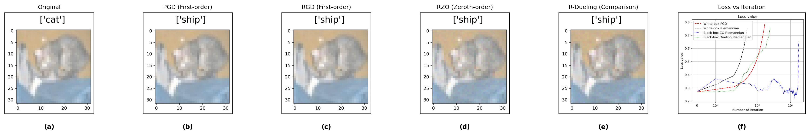

# Dueling Attack

 This project implements a dueling-based black-box attack on CIFAR datasets, where the attacker learns through comparative feedback rather than explicit gradients or loss values. The method builds on comparison-oracle optimization, simulating human-like preference judgments (“image A looks more adversarial than image B”) to iteratively craft adversarial examples that fool the target model.

## Example

The following example demonstrates an experimental result, where images starting with the prefix `1_` in the `results/` folder are combined into a 6-panel comparison figure.  
The six subplots represent:

(a) **Original image**

**First-order methods** (require gradient information):  
(b) Projected Gradient Descent (PGD) attack result  
(d) Riemannian Gradient Descent (RGD) attack result  

**Zeroth-order methods** (require function values only):  
(e) RZO attack result

**Comparison-oracle method:**  
(c) Riemannian Dueling (R-Dueling) attack result  

(f) Loss vs. iteration

