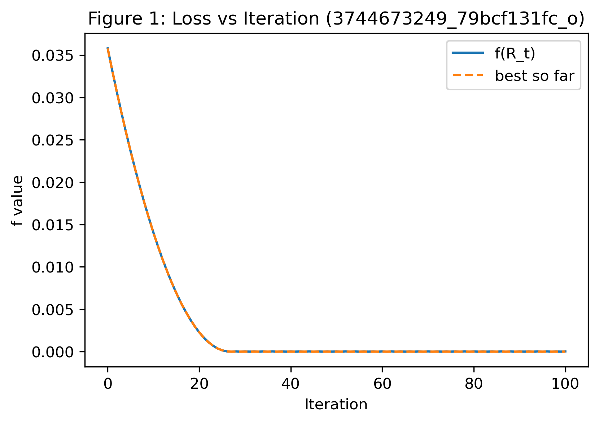
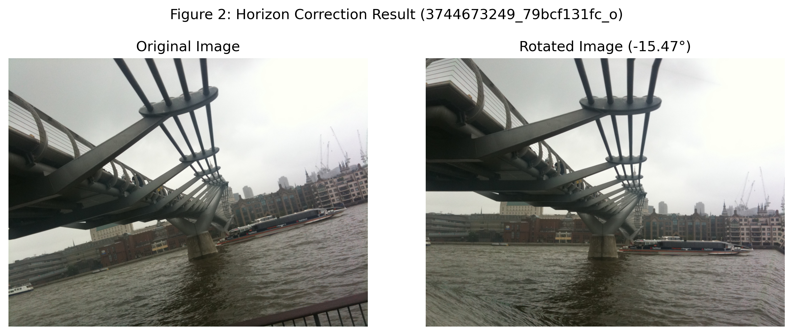

# Dueling-Based Optimization Applications

This repository contains two applications built on **dueling (comparison-oracle) optimization** — a paradigm where learning occurs through *comparative* feedback rather than direct gradient or function-value access.  
Both applications demonstrate how preference-based optimization can effectively solve real-world problems in computer vision and geometry.

---

## 1. Overview

This repository consists of two main experimental applications:

1. **Dueling Attack on Deep Neural Networks (CIFAR-10)** — a comparison-oracle–based black-box adversarial attack.
2. **Horizon-Leveling Optimization on SO(2)** — a geometric optimization problem for horizon correction in tilted images, solved via dueling optimization on the rotation group SO(2).

Each application is self-contained, and their respective results are stored under dedicated folders (`results/` for the CIFAR attack and `horizon/result/` for the horizon correction task).

---

## 2. Dueling Attack on Deep Neural Networks

This project implements a dueling-based black-box attack on CIFAR datasets, where the attacker learns through comparative feedback rather than explicit gradients or loss values.  
The method builds on comparison-oracle optimization, simulating human-like preference judgments (“image A looks more adversarial than image B”) to iteratively craft adversarial examples that fool the target model.

### Example

The following example demonstrates an experimental result, where images starting with the prefix `1_` in the `results/` folder are combined into a 6-panel comparison figure.  
The six subplots represent:

(a) **Original image**

**First-order methods** (require gradient information):  
(b) Projected Gradient Descent (PGD) attack result  
(d) Riemannian Gradient Descent (RGD) attack result  

**Zeroth-order methods** (require function values only):  
(e) RZO attack result  

**Comparison-oracle method:**  
(c) Riemannian Dueling (R-Dueling) attack result  

(f) Loss vs. iteration


---

## 3. Horizon-Leveling Optimization on SO(2)

The second application extends the dueling-oracle framework to a **geometric vision problem** — estimating the correct horizon alignment of a tilted image.  
Here, the optimization variable lies on the **special orthogonal group SO(2)** (the 2D rotation manifold).  
Instead of using ground-truth rotation angles or gradient information, the algorithm learns from pairwise *comparisons* of horizon alignment quality.

### Description

- The optimizer starts from an initial rotation (0°) and iteratively queries a dueling oracle that provides comparative feedback — e.g., “rotation A looks more level than rotation B.”  
- The method efficiently converges to the optimal correction angle, even without access to true function values or gradients.  
- Numerical results show robust and accurate horizon correction on natural images.

### Example

The following example uses results from the `horizon/result/` directory.  
The two figures below illustrate a sample image correction and its optimization curve.

<p align="center">
  
  
</p>

**Left:** Convergence curve showing objective value vs. iteration.
**Right:** Original and corrected images (before and after rotation).  

## 5. Environment Setup

Both the **CIFAR Dueling Attack** and the **Horizon-Leveling Optimization** experiments were implemented in Python using PyTorch and manifold optimization libraries.  
To ensure reproducibility, we recommend using a Conda environment with Python 3.10.

### Installation
Create and activate a new environment and install the dependencies:
```bash
pip install -r requirements.txt
```

## 6. Acknowledgements and References

This repository builds upon previous open-source research projects and datasets.  
We acknowledge their contributions below.

### Code Base

Parts of the manifold and zeroth-order optimization framework are adapted from the following open-source implementation:

> **Zeroth-order-Riemannian**  
> Jiaxiang Li, Krishnakumar Balasubramanian, and Shiqian Ma.  
> *Stochastic Zeroth-Order Riemannian Derivative Estimation and Optimization.*  
> arXiv preprint arXiv:2003.11238, 2020.  
> [GitHub Repository](https://github.com/JasonJiaxiangLi/Zeroth-order-Riemannian)

**BibTeX:**
```bibtex
@article{li2020stochastic,
  title={Stochastic zeroth-order riemannian derivative estimation and optimization},
  author={Li, Jiaxiang and Balasubramanian, Krishnakumar and Ma, Shiqian},
  journal={arXiv preprint arXiv:2003.11238},
  year={2020}
}
```

### Dataset

The dataset used for the **Horizon-Leveling Optimization** experiments is the **Horizon Lines in the Wild (HLW)** dataset, introduced in:

> **Horizon Lines in the Wild**  
> Scott Workman, Menghua Zhai, and Nathan Jacobs.  
> *British Machine Vision Conference (BMVC)*, 2016.  
> [Project Page](http://hlw.csr.uky.edu)

**BibTeX:**
```bibtex
@inproceedings{workman2016horizon,
  author={Workman, Scott and Zhai, Menghua and Jacobs, Nathan},
  title={Horizon Lines in the Wild},
  booktitle={British Machine Vision Conference (BMVC)},
  year={2016}
}
```

> *Note:* The **CIFAR-10** dataset used in the *Dueling Attack* experiments is a public benchmark dataset originally introduced by **Alex Krizhevsky, Vinod Nair, and Geoffrey Hinton** (2009).  
> [CIFAR-10 Dataset Page](https://www.cs.toronto.edu/~kriz/cifar.html)
